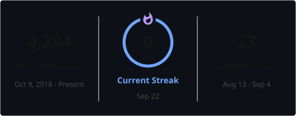

## 👋 About

I'm a senior mobile engineer. Most of my work is Android, Kotlin Multiplatform, and the native layer underneath both. I led mobile engineering on [Sky Go](https://www.davthecoder.com/portfolio/sky-go), used by millions of Sky subscribers.

I arrived in the UK with almost no English and no degree, and taught myself to code on a second-hand laptop. I still try to leave code the next person can maintain.

## 🚀 Selected work

**[Sky Go](https://www.davthecoder.com/portfolio/sky-go)**  
Sky's live TV and on-demand app. I led the mobile team and stayed hands-on on native Android and iOS: live playback, Widevine and FairPlay, licence-aware downloads.

**[Klarinet](https://github.com/vectencia/Klarinet)**  
An open-source Kotlin Multiplatform audio SDK. You write the calling code once in Kotlin; it goes to Oboe on Android and AVAudioEngine on Apple. The effects run in a shared C++ DSP core so a reverb sounds the same on both platforms. On [klibs.io](https://klibs.io/project/vectencia/Klarinet).

**[Paglipat](https://www.paglipat.com)**  
A travel site I built in 11 languages. Flight search, relocation guides, and a live concierge that has to look up visa rules through tools. The model is not allowed to remember a day count or a fee.

**[Churust](https://github.com/davthecoder/Churust)**  
I wanted Ktor's shape in Rust, so I wrote it. Routing, `install(plugin)`, typed extractors, secure defaults, on top of tokio and hyper. On [crates.io](https://crates.io/crates/churust). [User guide](https://davthecoder.github.io/Churust/).

Earlier jobs included native Android on [BritBox](https://www.davthecoder.com/portfolio/britbox), [NOW](https://www.davthecoder.com/portfolio/now-tv), [WWE Universe](https://www.davthecoder.com/portfolio/wwe-universe), [BetMGM](https://www.davthecoder.com/portfolio/betmgm), and [My5](https://www.davthecoder.com/portfolio/my5), at Sky, Deltatre, Massive Interactive, and IGT.

## 🧰 What I work with

## 🏢 Built software at

## 🧪 Also on GitHub

Smaller repos I use to try things:

- [Financial Rust and Android](https://github.com/davthecodercom/Financial-RustAndAndroid): Rust technical indicators behind a Kotlin / Compose UI
- [Financial Rust and Swift](https://github.com/davthecodercom/Financial-RustAndSwift): the same Rust code called from iOS
- [Zig on Android](https://github.com/davthecodercom/ZigOnAndroid): calling Zig from an Android app
- [KMP for Apple TV](https://github.com/davthecodercom/KMP-for-AppleTV): a starting point for Kotlin Multiplatform on tvOS

## 📖 Writing

Recent posts from [davthecoder.com](https://www.davthecoder.com/blog):

<!-- BLOG-POST-LIST:START -->
- [Memory Management Across JNI: Ownership, Box::into_raw, Global Refs, and Leaks](https://www.davthecoder.com/blog/jni-memory-management-rust-ownership-leaks/) — *Sep 4, 2026*
- [Why Paglipat Runs on Astro, Go, and Flutter](https://www.davthecoder.com/blog/paglipat-architecture-astro-go-flutter/) — *Sep 2, 2026*
- [Passing Data Between Kotlin and Rust: Strings, Arrays, ByteBuffers, and Zero-Copy](https://www.davthecoder.com/blog/passing-data-kotlin-rust-jni-bytebuffers-zero-copy/) — *Aug 28, 2026*
- [Fast Image Processing on Android with Rust: Bitmaps, Filters, and the JNI Fast Path](https://www.davthecoder.com/blog/fast-image-processing-android-rust-benchmarks/) — *Aug 21, 2026*
- [Project Structure: Gradle + Cargo in One Build, ABI Splits, Debug/Release Flavors](https://www.davthecoder.com/blog/android-project-structure-gradle-cargo-rust/) — *Aug 14, 2026*<!-- BLOG-POST-LIST:END -->

[More on the blog](https://www.davthecoder.com/blog)

I wrote *[You Are Not That Important](https://www.davthecoder.com/book)* in English and Spanish, and I teach Android on [Udemy](https://www.udemy.com/user/davidcruzanayadacran/) (20,000+ students). I also keep [machine learning notes](https://www.davthecoder.com/ai-ml) while I learn the subject.

## 📊 GitHub

## 🐍 Contribution activity

<picture>
  <source media="(prefers-color-scheme: dark)" srcset="https://raw.githubusercontent.com/davthecodercom/davthecodercom/output/github-snake-dark.svg" />
  <source media="(prefers-color-scheme: light)" srcset="https://raw.githubusercontent.com/davthecodercom/davthecodercom/output/github-snake.svg" />
  
</picture>

## 📫 Connect

